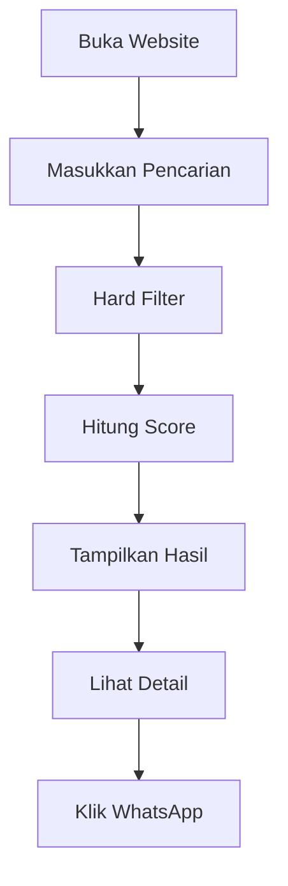
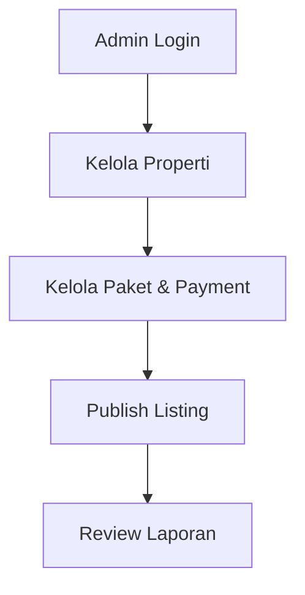

<div align="center">

<!-- HEADER ANIMATION -->


### 🏠 Platform Pencarian Rumah, Kontrakan, & Kos  
**Tanpa Akun User • Data Bersih • Pencarian Relevan**

<br/>


<br/><br/>

**PropertiKita** adalah platform web untuk membantu orang menemukan  
**rumah, kontrakan, dan kos** dengan cepat, relevan, dan data yang lebih terpercaya  
— **tanpa harus membuat akun user**.

</div>

---

## 🎯 Tujuan Produk
Sebagian besar website properti hari ini:
- Listing palsu & tidak terkontrol  
- Hasil pencarian tidak relevan  
- Terlalu banyak langkah hanya untuk melihat kontak  

**PropertiKita dibangun untuk memotong semua itu.**

Fokus utama:
- 🔍 Pencarian cepat & relevan  
- 🧹 Data properti bersih (kurasi admin)  
- 🚀 User langsung cari & kontak tanpa login  

---

## ⚡ Prinsip Produk
- **Tanpa akun user**  
  → langsung pakai, minim friction

- **Listing dikelola Admin**  
  → kualitas data terjaga, anti iklan ngibul

- **Pencarian berbasis ranking/scoring**  
  → relevansi menang, bukan sekadar “yang terbaru”

---

## 🧩 Role Sistem (Hanya 2)
### 🛡️ Admin (Login)
Admin bertanggung jawab penuh terhadap data:

- Tambah / edit / hapus properti
- Upload & atur foto (cover & urutan)
- Set status:
  - `published`
  - `available`
  - `verified`
- Moderasi laporan user
- Mengelola fasilitas, kategori, dan highlight
- Mengelola paket & pembayaran listing

---

### 👤 Public User (Tanpa Login)
User bisa langsung:
- Cari & filter properti
- Lihat list atau map view
- Lihat detail (foto, fasilitas, lokasi)
- Simpan favorit (cookie/session)
- Klik kontak (WhatsApp / telepon)
- Kirim laporan listing bermasalah

---

## 💳 Sistem Payment Gateway
Payment **tidak untuk user pencari**, tapi untuk **layanan properti premium**.

### Fungsi Payment
- Promosi / boost listing
- Highlight properti
- Paket tayang prioritas

### Konsep Pembayaran
- Admin membuat paket (misal: Highlight 7 hari)
- Pembayaran via **Payment Gateway**
- Setelah pembayaran sukses:
  - Status paket aktif
  - Listing otomatis naik prioritas

> Sistem payment ini **optional di MVP**, tapi arsitekturnya sudah disiapkan.

---

## ☎️ Kontak Admin (Langsung WhatsApp)
Jika user:
- Mau tanya langsung
- Mau pasang properti
- Mau kerja sama

➡️ **Kontak Admin 1 klik**

📲 **WhatsApp Admin:**  
👉 [Klik untuk Chat Admin](https://wa.me/628XXXXXXXXXX)

*(Nomor bisa diganti di config/env tanpa ubah kode frontend)*

---

## 🧱 Tech Stack
### Backend
- Laravel
- PHP 8+
- MySQL

### Admin Panel
- Filament v3  
  - CRUD properti
  - Moderasi data
  - Manajemen paket & pembayaran

### Frontend
- Blade
- Tailwind CSS
- Alpine.js (interaksi ringan)

---

## 🗂️ Konsep Data (MVP)
Entity utama:
- `properties`
- `property_photos`
- `facilities`
- `facility_property`
- `reports`
- `contact_clicks`
- `payment_packages`
- `payments`

User tanpa akun → semua interaksi dicatat sebagai **event**, bukan profil.

---

## 🔍 Algoritma Pencarian (Inti Produk)

### Tahap 1 — Hard Filter
- `published = true`
- `available = true`
- Filter tipe
- Filter harga
- Filter radius (lokasi)

Radius dihitung menggunakan **Haversine Formula**.

---

### Tahap 2 — Ranking (Scoring)
Bobot MVP:
- Kedekatan lokasi → **40%**
- Kesesuaian harga → **25%**
- Status verified → **20%**
- Popularitas (klik kontak) → **10%**
- Update terbaru → **5%**

```text
score =
  (location_score * 40)
+ (price_score    * 25)
+ (verified_score * 20)
+ (popularity     * 10)
+ (freshness      * 5)
````

Properti dengan skor tertinggi tampil lebih dulu.

---

## 🛡️ Anti-Spam & Trust System

* Rate limit laporan (per IP)
* Captcha ringan
* Laporan valid berlebih → listing disembunyikan sementara
* Admin review manual

---

## 🧭 Alur Sistem

### User Flow



### Admin Flow



---

## 🧪 Scope MVP

### Dibangun

* Admin CRUD properti
* Upload foto
* Ranking & search
* Kontak WhatsApp
* Sistem payment basic

### Ditunda

* Akun user
* Booking & chat internal
* Review berbasis akun

---

## 📌 Filosofi Produk

> **Lebih baik sedikit tapi bersih**
> daripada banyak tapi berantakan.

PropertiKita dibangun untuk dipakai orang sungguhan,
bukan sekadar repo pamer.

---

<div align="center">


</div>


